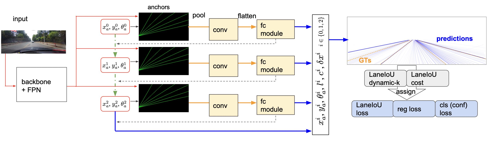
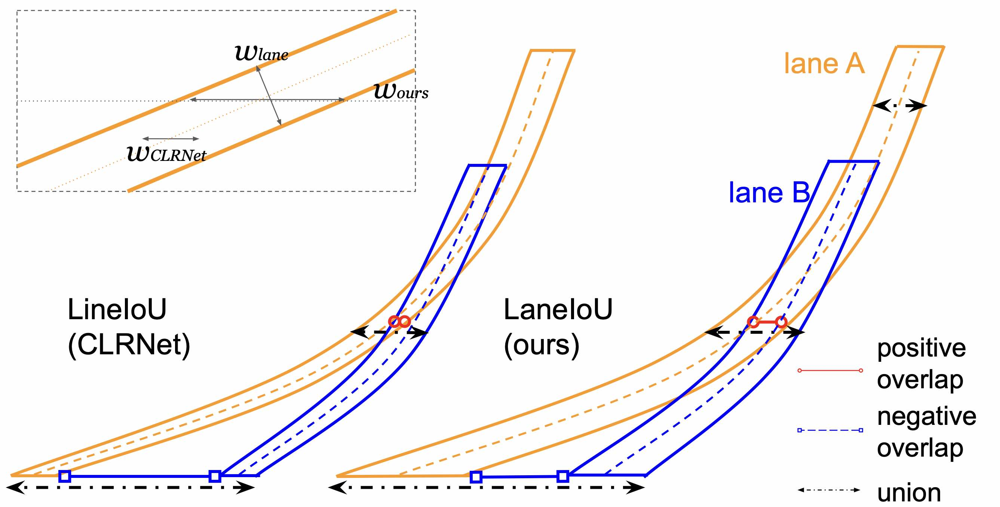

[](https://paperswithcode.com/sota/lane-detection-on-culane?p=clrernet-improving-confidence-of-lane)

# CLRerNet Official Implementation

The official implementation of [our paper](https://arxiv.org/abs/2305.08366) "CLRerNet: Improving Confidence of Lane Detection with LaneIoU", by Hiroto Honda and Yusuke Uchida.

## Method

CLRerNet features LaneIoU for the target assignment cost and loss functions aiming at the improved quality of confidence scores.<br>
LaneIoU takes the local lane angles into consideration to better correlate with the segmentation-based IoU metric.

<p align="left"> </p>
<p align="left"> </p>

## What's New

- ** Our CLRerNet paper has been accepted to WACV2024 ! ** (Oct. 25, 2023)
- LaneIoU loss and cost are published. ([PR#17](https://github.com/hirotomusiker/CLRerNet/pull/17), Oct.22, 2023)


## Performance

CLRerNet achieves the <b>state-of-the-art performance on CULane benchmark </b> significantly surpassing the baseline.

Model           | Backbone | F1 score | GFLOPs
---             | ---      | ---           | ---
CLRNet        | DLA34    | 80.47  | 18.4
[CLRerNet](https://github.com/hirotomusiker/CLRerNet/releases/download/v0.1.0/clrernet_culane_dla34.pth)        | DLA34    | 81.12&pm;0.04 <sup>*</sup>| 18.4
[CLRerNet&#8902;](https://github.com/hirotomusiker/CLRerNet/releases/download/v0.1.0/clrernet_culane_dla34_ema.pth) | DLA34    | 81.43&pm;0.14 <sup>*</sup> | 18.4


\* F1 score stats of five models reported in our paper. The release models' scores are 81.11 (CLRerNet) and 81.55 (CLRerNet&#8902;, EMA model) respectively.

## Install

Docker environment is recommended for installation:
```bash
docker-compose build --build-arg UID="`id -u`" dev
docker-compose run --rm dev
```

See [Installation Tips](docs/INSTALL.md) for more details.

## Inference

Run the following command to detect the lanes from the image and visualize them:
```bash
python demo/image_demo.py demo/demo.jpg configs/clrernet/culane/clrernet_culane_dla34_ema.py clrernet_culane_dla34_ema.pth --out-file=result.png
```

## Test

Run the following command to evaluate the model on CULane dataset:

```bash
python tools/test.py configs/clrernet/culane/clrernet_culane_dla34_ema.py clrernet_culane_dla34_ema.pth
```

For dataset preparation, please refer to [Dataset Preparation](docs/DATASETS.md).

## Train

Coming soon...

## Frame Difference Calculation

Filtering out redundant frames during training helps the model avoid overfitting to them. We provide a simple calculator that outputs an npz file containing frame difference values.

```bash
python tools/calculate_frame_diff.py [culane_root_path]
```

## Citation

```BibTeX
@article{honda2023clrernet,
      title={CLRerNet: Improving Confidence of Lane Detection with LaneIoU},
      author={Hiroto Honda and Yusuke Uchida},
      journal={arXiv preprint arXiv:2305.08366},
      year={2023},
}
```

## References

* [Turoad/CLRNet](https://github.com/Turoad/CLRNet/)
* [lucastabelini/LaneATT](https://github.com/lucastabelini/LaneATT)
* [aliyun/conditional-lane-detection](https://github.com/aliyun/conditional-lane-detection)
* [CULane Dataset](https://xingangpan.github.io/projects/CULane.html)
* [open-mmlab/mmdetection](https://github.com/open-mmlab/mmdetection)
* [optn-mmlab/mmcv](https://github.com/open-mmlab/mmcv)
